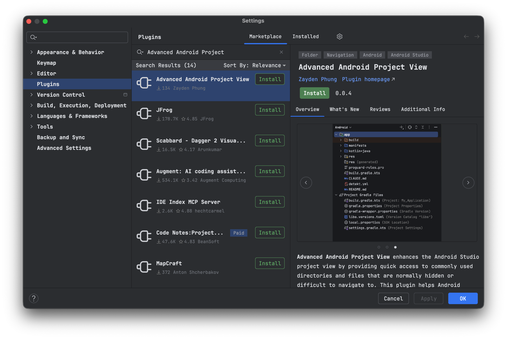
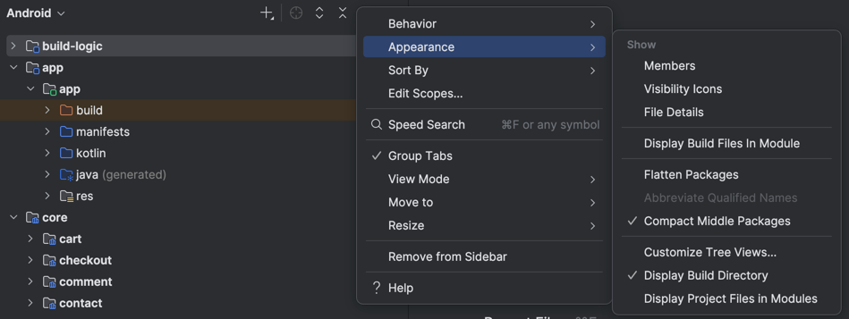
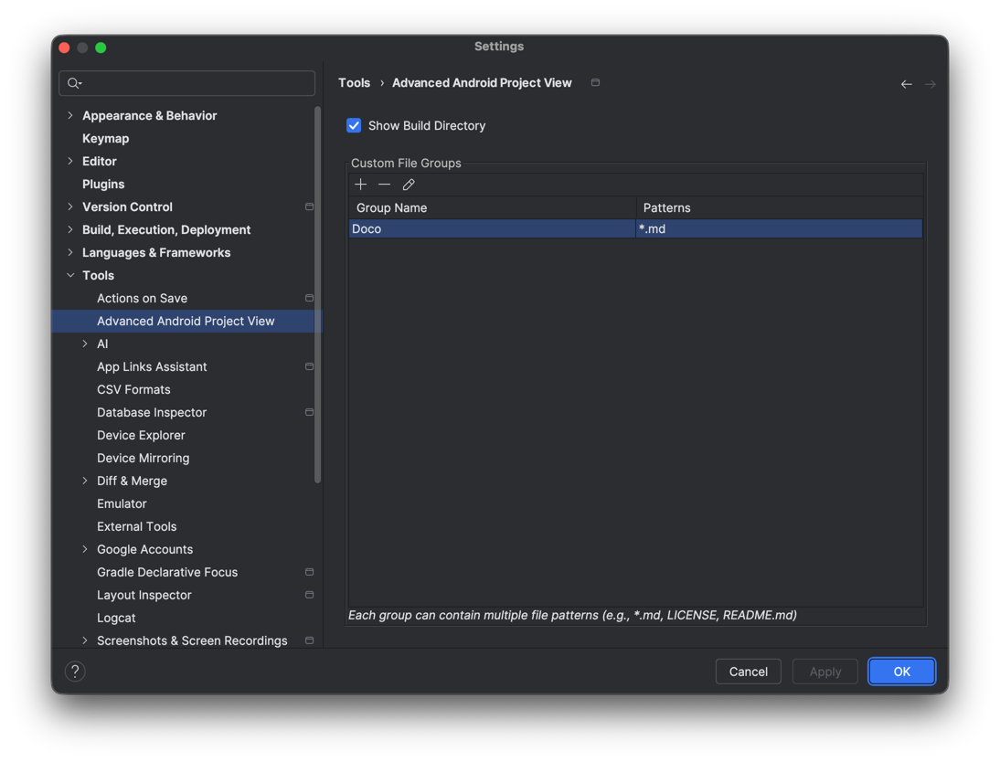
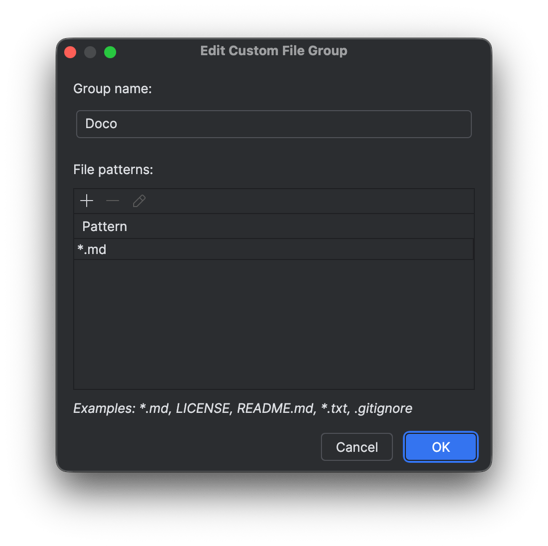

<h1 align="center">Advanced Android Project View (A2PT)</h1></br>

<p align="center">
  <a href="https://opensource.org/licenses/Apache-2.0"></a>
  <a href="https://plugins.jetbrains.com/plugin/29265-revenuecat-dashboard"></a>
  <a href="https://github.com/z8dn/advanced-android-project-view/actions"></a>
</p>

<!-- Plugin description -->
**Advanced Android Project View** enhances the Android Studio project view by providing quick access to commonly used directories and files that are normally hidden or difficult to navigate to. This plugin helps Android developers streamline their workflow by making build directories readily accessible and organizing project files with customizable groups in the project tree.
<!-- Plugin description end -->

## Features

### 🗂️ Build Directory Visibility
Toggle visibility of `build` directories for all modules directly in the Android Project View. No more navigating through the file system to inspect build outputs, APKs, or generated files.

### 📦 Custom Project File Grouping
Organize and access project-level files with customizable groups:
- Create named groups for any file pattern (e.g., "Documentation" for `*.md`, "AI Rules" for `CLAUDE.md`, "Configs" for `*.yml`)
- Support for wildcard patterns (`*.md`, `*.yml`) and exact filenames (`CLAUDE.md`)
- Smart icons that automatically match file types for single-pattern groups
- Display files at project root or within their respective modules
- Perfect for quick access to documentation, configuration files, AI rules, and other project-wide resources

### 🎯 Module-Level Control
Works seamlessly with both Android and non-Android Gradle modules, automatically adapting to your project structure.

## 🗺️ Roadmap

We have exciting plans for future updates! Here are some features currently under consideration or in development:

- [x] **Cloud Sync**: Sync your custom group configurations across different machines
- [ ] **Saved Presets**: Pre-defined file groups for common stacks (KMP, Compose Multiplatform, etc.)
- [ ] **Dynamic Icons**: Customizable icons for specific file patterns
- [ ] **Enhanced Filtering**: More advanced pattern matching for file groups

Have a suggestion? Feel free to open an [issue](https://github.com/z8dn/advanced-android-project-view/issues) or start a [discussion](https://github.com/z8dn/advanced-android-project-view/discussions)!

## Installation

### From JetBrains Marketplace (Recommended)
1. Open Android Studio/IntelliJ IDEA
2. Go to **Settings/Preferences** (⌘, on Mac or Ctrl+Alt+S on Windows/Linux) → **Plugins** → **Marketplace**
3. Search for "Advanced Android Project View"
4. Click **Install** and restart Android Studio/IntelliJ IDEA


### Manual Installation
1. Download the [latest release](https://github.com/z8dn/advanced-android-project-view/releases/latest)
2. Open Android Studio
3. Go to **Settings/Preferences** (⌘, on Mac or Ctrl+Alt+S on Windows/Linux) → **Plugins** → ⚙️ → **Install Plugin from Disk...**
4. Select the downloaded ZIP file
5. Restart Android Studio

## Usage

### Toggle Build Directory Visibility
1. Open the Android Project View
2. Click the **Android** dropdown at the top of the project pane
3. Look for "Display Build Directory" in the appearance actions menu
4. Toggle the option on/off

Alternatively, right-click in the Project View toolbar and select appearance options.

### Configure Project File Groups
1. Go to **Settings/Preferences** → **Tools** → **Advanced Android Project View**
2. Click **Add** to create a new file group
3. Enter a group name (e.g., "Documentation", "AI Rules")
   
4. Add file patterns using wildcards (e.g., `*.md`) or exact filenames (e.g., `CLAUDE.md`)

5. Click **OK** to apply changes

**Pattern Examples:**
- `*.md` - All Markdown files
- `CLAUDE.md` - Claude AI rules file
- `*.yml` - All YAML configuration files

Your preferences are saved automatically and will persist across IDE restarts.

## Compatibility

- **Android Studio**: Otter 2 Feature Drop (2025.2.2) and later
- **IntelliJ IDEA Ultimate**: 2025.2+ with Android plugin
- **Platform**: All (Windows, macOS, Linux)

## Building from Source

### Prerequisites
- JDK 21 or later
- Gradle 8.14.3 or later (included via wrapper)
- Android Studio Otter 3 or later (for local development)

### Build Steps

```bash
# Clone the repository
git clone https://github.com/z8dn/advanced-android-project-view.git
cd advanced-android-project-view

# Build the plugin
./gradlew buildPlugin

# The plugin ZIP will be created in build/distributions/
```

## License

```text
Copyright (c) 2026 z8dn

Licensed under the Apache License, Version 2.0 (the "License");
you may not use this file except in compliance with the License.
You may obtain a copy of the License at

    https://www.apache.org/licenses/LICENSE-2.0

Unless required by applicable law or agreed to in writing, software
distributed under the License is distributed on an "AS IS" BASIS,
WITHOUT WARRANTIES OR CONDITIONS OF ANY KIND, either express or implied.
See the License for the specific language governing permissions and
limitations under the License.
```

## Acknowledgments

- Built with [IntelliJ Platform Plugin Template](https://github.com/JetBrains/intellij-platform-plugin-template)
- Inspired by the need for better Android project navigation
- Thanks to all [contributors](https://github.com/z8dn/advanced-android-project-view/graphs/contributors)

## Support

- 🐛 [Issue Tracker](https://github.com/z8dn/advanced-android-project-view/issues)
- 💬 [Discussions](https://github.com/z8dn/advanced-android-project-view/discussions)

---

**Made with ❤️ for the Android developer community**
